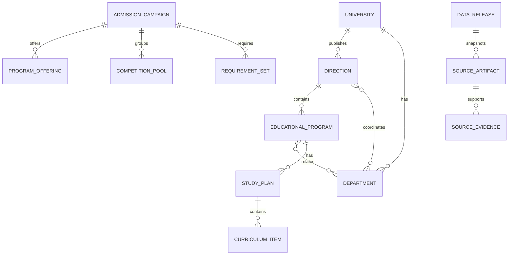

# Data model

## Release-scoped catalog

Every typed source-backed row belongs to a `data_release`. Relations include `release_id` in their foreign-key constraints, so a row cannot be linked across releases. Internal primary keys are UUIDs, but clients identify records with their stable `external_key` or an official code.

| Entity family | Main facts and relationships |
| --- | --- |
| `universities` | Official identity and university-level evidence |
| `directions` | Official direction code, name, description, department relations, and programs |
| `departments` | Official department code, name, faculty and campus scope |
| `educational_programs` | Profile code/name, direction, many-to-many department roles, course, plan, and offering references |
| `study_plans`, `curriculum_items` | The profile-linked plan version and ordered discipline/semester/hour/control facts |
| `admission_campaigns`, `campaign_calendar_events` | Campaign year/level/kind and source-stated dates |
| `program_offerings`, `competition_pools`, `place_quota_assertions` | Program-level offers, contest groups, place counts and quota types |
| `admission_requirement_sets`, `admission_requirement_nodes` | Ordered boolean trees with operators, thresholds, leaves, and exam references |
| `tuition_assertions` | Source table row, direction/program codes, academic year, amount and currency |
| `historical_admission_statistics`, `admission_statistics` | Historical official outcomes and current campaign aggregates in separate tables |
| `individual_achievement_policies`, `admission_documents` | Official policy rows and admission-document metadata; no applicant's personal achievements |
| `source_artifacts`, `source_evidence`, `source_observations` | Captured source files/pages, provenance claims, and field locators |
| `source_relationships`, `manual_review_items` | Explicit source links and unresolved/uncertain associations |

## Link status and unknown data

An unresolved `direction_id`, `department_id`, or `program_id` remains `NULL`. If the source supplies a code, the typed source-code column retains it. The API exposes a null canonical key and a status; it never silently joins by display name. Manual-review entries keep the source/target keys, candidate keys, reason, and source locator where available.

Missing descriptions, unavailable plan files, non-explicit campus/date values, and absent amounts remain `null` or carry the source's explicit unavailable state. Import and API layers do not fill those gaps with inferred values.

## Evidence integrity

Generic `source_evidence` preserves field paths and source locators. Dedicated bridges such as `program_evidence`, `offering_evidence`, `curriculum_evidence`, and `requirement_node_evidence` attach evidence to canonical rows using composite foreign keys. This keeps generic provenance while preserving referential integrity for important entity types.

## Time and immutable snapshots

An imported release is immutable after commit. A correction becomes a new release; source records are not overwritten in place.

| Field | Meaning |
| --- | --- |
| `valid_from`, `valid_to` | Period stated by the source; nullable if not stated |
| `observed_at` | Source observation date/time when present in the captured data |
| `ingested_at` | Database insertion time |
| `committed_at` | Time the import transaction committed and activated the release |

`tuition_assertions`, `competition_pools`, quota assertions, requirement sets, and statistics are separate source assertions, not one mutable “current value” column. Historical results and current campaign statistics remain distinct.

## Requirements operators

`admission_requirement_nodes` store a tree with stable source-backed order. Operator nodes retain `AND`, `OR`, or `AT_LEAST`; `AT_LEAST` retains its threshold. Leaf nodes retain the subject/exam code, minimum score, choice flag, tiebreak rank, and evidence. The public DTO validates threshold consistency and returns the original nesting.

## Deliberate exclusions

The service contains no applicant profile, personal score, preference list, quota entitlement, or olympiad profile/benefit tables. No such records are exposed through the API. The decision-policy `rule_packs` family remains empty until a separately sourced policy is approved; it is not a replacement for admission requirement trees.
